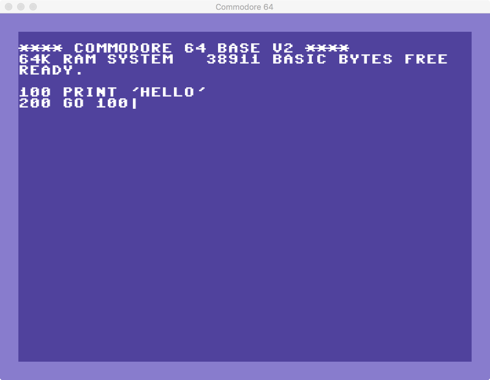

# Commodore 64 in Love2D

I am trying to mimic the behavior of Commodore 64, but this project doesn't aim to be a full-featured emulator, there are others real emulators like [vice](http://vice-emu.sourceforge.net/). My goal here is to interpret part of the Basic language, allowing to print to output, read from the input and some basic drawing commands. It can be used for educational purposes or for fun.

Right now there is only the screen and commands to output and input text. I am working on the Basic interpreter.

**Incomplete Project - Work In Progress**

## Requirements
- [Love2D](https://love2d.org/) > 11.1

## Features
- [X] Emulating the Look n' Feel of Commodore 64
- [X] Input/Output Buffer
- [ ] Basic Interpreter
- [ ] Sprite Editor
- [ ] Save/Load Basic Programs

## License
[Apache 2.0](LICENSE)
